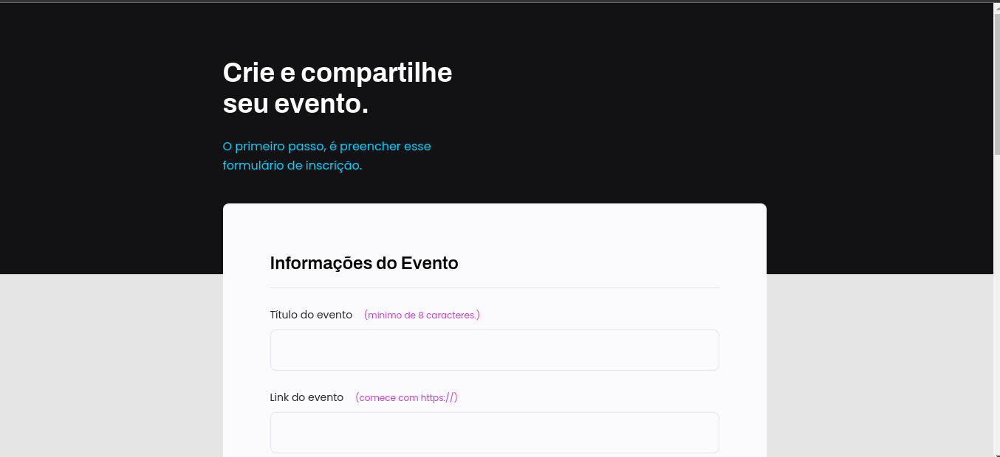

  

## 🚀 Tecnologias

Esse projeto foi desenvolvido com as seguintes tecnologias:

- [HTML](https://developer.mozilla.org/pt-BR/docs/Web/HTML)
- [CSS](https://developer.mozilla.org/pt-BR/docs/Web/CSS)

## 💻 Projeto

O projeto Rocket.event é site para criação de eventos, ele foi elaborado na aula do Stage03 no programa Explorer da Rocketseat.

- [Página](https://leokazuyukinagatani.github.io/rocket-event//)

## 🔖 Layout

No link abaixo você encontra o layout do projeto web. Lembrando que você precisa ter uma conta no [Figma](http://figma.com/) para acessá-lo.

<a href="https://www.figma.com/file/YFZeVevZiSPgnsl7Q6WniW/Explorer-Stage-03-Projeto-01-(Copy)?node-id=0%3A1" target="_blank">- [Layout Web]</a>

